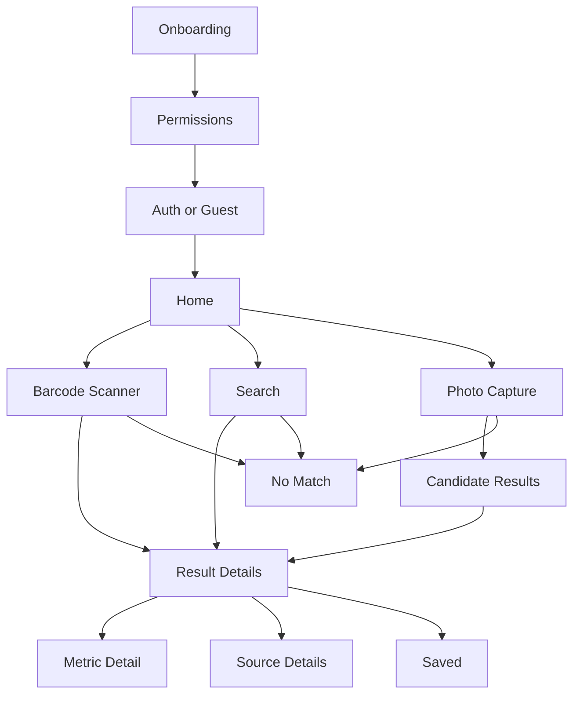

# Green Life Screen Map

## 1. Primary App Structure

Bottom navigation for MVP:
- Home
- Search
- Saved
- Profile

Primary entry actions from Home:
- Scan Barcode
- Take Photo
- Search Product

Modal and secondary flows:
- Login / Sign Up
- Permissions
- Result Details
- Source Details
- Error / No Match
- Save Confirmation

## 2. Screen-by-Screen Map

### A. Onboarding
Purpose:
Explain value and request required permissions.

Content:
- App name and value proposition
- "Scan products. Understand environmental impact."
- Short explanation of confidence labels
- CTA: Continue
- Optional CTA: Sign in later

Actions:
- Continue to permissions
- Skip to app shell

### B. Permissions
Purpose:
Request camera access for scanning.

Content:
- Camera permission request
- Optional photo library permission
- Explanation of why access is needed

Actions:
- Allow camera
- Not now

### C. Auth
Variants:
- Sign In
- Sign Up
- Continue as Guest

Purpose:
Allow account creation for saved history.

Content:
- Email
- Password or passwordless option
- Guest option

Actions:
- Sign in
- Create account
- Continue as guest

### D. Home
Purpose:
Primary launchpad for item identification.

Content:
- Search bar
- Primary CTA: Scan Barcode
- Secondary CTA: Take Photo
- Recent items preview
- Short note: "Results may be exact or estimated"

Actions:
- Open barcode scanner
- Open camera/photo flow
- Start search
- Open recent item

### E. Barcode Scanner
Purpose:
Fastest exact-match path.

Content:
- Camera viewfinder
- Manual code entry fallback
- Flash toggle
- Cancel

Actions:
- Scan code
- Enter code manually
- Cancel to Home

Outcomes:
- Exact match -> Result Details
- No match -> No Match / Search Fallback

### F. Search
Purpose:
Manual lookup by product, brand, material, or category.

Content:
- Search input
- Suggested recent searches
- Search results list
- Filter chips:
  - Products
  - Brands
  - Categories
  - Materials

Actions:
- Enter query
- Select result
- Refine search

Outcomes:
- Result selected -> Result Details
- No result -> No Match

### G. Photo Capture / Upload
Purpose:
Fallback for non-barcode items and future OCR/object recognition.

Content:
- Camera capture
- Upload from library
- Guidance text: "Capture label, brand, or product clearly"

Actions:
- Take photo
- Upload image
- Retake
- Continue

Outcomes:
- OCR/match found -> Candidate Results or Result Details
- Weak match -> Search suggestions
- No match -> No Match

### H. Candidate Results
Purpose:
Let user disambiguate between likely matches.

Content:
- "We found possible matches"
- Ranked list of products/categories
- Confidence hint per option

Actions:
- Select a candidate
- Search again
- Cancel

### I. Result Details
Purpose:
Core product value screen.

Sections:
- Item header
  - product/category name
  - brand if known
  - image if available
- Match banner
  - Exact Product Match
  - Probable Product Match
  - Category Estimate
  - Material Estimate
- Summary metrics
  - Carbon footprint
  - Material composition
  - Recycled content
  - Recyclability
  - Disposal guidance
  - Hazard flags if available
- Source section
- Save button
- Compare alternatives placeholder for future phase

Actions:
- Save item
- Expand metric details
- Open source details
- Share result later if added

### J. Metric Detail
Purpose:
Explain one metric in more detail.

Content:
- Metric name
- Value and unit
- Scope
- Methodology summary if available
- Source
- Dataset date/version
- Confidence note

Actions:
- Open source details
- Back to result

### K. Source Details
Purpose:
Build trust through provenance.

Content:
- Source name
- Source type: EPA / EPD / manufacturer / factor dataset
- Record date or ingestion date
- Link/reference metadata
- Notes on exact vs estimated derivation

Actions:
- Back to result

### L. No Match
Purpose:
Handle lookup failure gracefully.

Content:
- "We couldn't find an exact match"
- Suggested next steps:
  - Try search
  - Retake photo
  - Scan again
  - View category estimates if possible

Actions:
- Retry scan
- Search manually
- Use closest category

### M. Saved
Purpose:
Retain long-term value.

Content:
- Saved items list
- Recent scans/searches
- Sort by recent / name

Actions:
- Open saved item
- Remove saved item

### N. Profile
Purpose:
Account and settings.

Content:
- Account status
- Sign in/out
- Permission settings
- About confidence labels
- Privacy and terms links

Actions:
- Manage account
- Sign out
- Open help/about

### O. Admin Web Panel
Internal only.

Views:
- Product search
- Source records
- Match review queue
- Confidence anomalies
- Manual mapping override

## 3. Core Navigation Flow



## 4. Text Wireframes

### Home
```text
--------------------------------------------------
| Green Life                                     |
| Search products, brands, materials             |
| [ Search bar............................... ]  |
|                                                |
| [ Scan Barcode ]                               |
| [ Take Photo  ]                                |
|                                                |
| Recent                                          |
| - Stainless Bottle                              |
| - Laundry Detergent                             |
| - Cardboard Box                                 |
|                                                |
| Note: Results may be exact or estimated.       |
|                                                |
| Home   Search   Saved   Profile                |
--------------------------------------------------
```

### Barcode Scanner
```text
--------------------------------------------------
| < Back                    Scan Barcode         |
|                                                |
|               [ Camera Viewfinder ]            |
|                                                |
| Align barcode inside the frame                 |
|                                                |
| [ Flash ]            [ Enter Code Manually ]   |
--------------------------------------------------
```

### Search
```text
--------------------------------------------------
| Search                                         |
| [ stainless water bottle................... ]  |
|                                                |
| Filters: [Products] [Brands] [Categories]      |
|                                                |
| Results                                         |
| ------------------------------------------------
| Reusable Water Bottle                          |
| Example Brand                                  |
| Probable Product Match                         |
| ------------------------------------------------
| Stainless Steel Drinkware                      |
| Category Estimate                              |
| ------------------------------------------------
| Vacuum Bottle                                  |
| Another Brand                                  |
| Exact Product Match                            |
| ------------------------------------------------
|                                                |
| Home   Search   Saved   Profile                |
--------------------------------------------------
```

### Photo Capture / Upload
```text
--------------------------------------------------
| < Back                     Add Photo           |
|                                                |
|             [ Camera Preview / Image ]         |
|                                                |
| Capture a label, product, or brand clearly     |
|                                                |
| [ Take Photo ]                                 |
| [ Upload From Library ]                        |
|                                                |
| After capture:                                 |
| [ Retake ] [ Continue ]                        |
--------------------------------------------------
```

### Candidate Results
```text
--------------------------------------------------
| Possible Matches                               |
| We found a few likely results                  |
|                                                |
| ------------------------------------------------
| Reusable Water Bottle                          |
| Example Brand                                  |
| Confidence: High                               |
| [ Select ]                                     |
| ------------------------------------------------
| Stainless Steel Drinkware                      |
| Category Estimate                              |
| Confidence: Medium                             |
| [ Select ]                                     |
| ------------------------------------------------
|                                                |
| [ Search Instead ]                             |
--------------------------------------------------
```

### Result Details
```text
--------------------------------------------------
| < Back                     Item Details        |
|                                                |
| [ Product Image ]                              |
| Reusable Water Bottle                          |
| Example Brand                                  |
|                                                |
| [ Exact Product Match ]                        |
| Confidence: 96%                                |
|                                                |
| Key Impact                                      |
| Carbon Footprint      2.4 kg CO2e              |
| Recycled Content      35%                      |
| Recyclability         Moderate                 |
| Material              Stainless Steel          |
| Disposal              Check local metal rules  |
|                                                |
| [ Save Item ]                                  |
|                                                |
| Sources                                         |
| EPD Database                                   |
| EPA Dataset                                    |
| [ View Source Details ]                        |
|                                                |
| Home   Search   Saved   Profile                |
--------------------------------------------------
```

### Metric Detail
```text
--------------------------------------------------
| < Back                 Carbon Footprint        |
|                                                |
| Carbon Footprint                               |
| 2.4 kg CO2e                                    |
|                                                |
| Scope: Product                                 |
| Estimate Type: Exact                           |
| Confidence: 91%                                |
|                                                |
| Methodology                                    |
| EPD-reported cradle-to-gate value              |
|                                                |
| Source                                         |
| EPD Database                                   |
| Version: 2026-01                               |
| Published: Jan 12, 2026                        |
| [ View Source ]                                |
--------------------------------------------------
```

### Source Detail
```text
--------------------------------------------------
| < Back                   Source Detail         |
|                                                |
| EPD Database                                   |
| Type: EPD                                      |
| Reference URL: [ link ]                        |
| Version: 2026-01                               |
| Published: Jan 12, 2026                        |
| Ingested: Feb 1, 2026                          |
|                                                |
| Notes                                          |
| Cradle-to-gate environmental declaration       |
--------------------------------------------------
```

### No Match
```text
--------------------------------------------------
| No Exact Match Found                           |
|                                                |
| We couldn't find this item exactly.            |
|                                                |
| Try one of these:                              |
| [ Search by name ]                             |
| [ Retake photo ]                               |
| [ Scan again ]                                 |
| [ Use category estimate ]                      |
--------------------------------------------------
```

### Saved
```text
--------------------------------------------------
| Saved                                          |
|                                                |
| ------------------------------------------------
| Reusable Water Bottle                          |
| Example Brand                                  |
| Saved Mar 5                                    |
| ------------------------------------------------
| Laundry Detergent                              |
| Brand X                                        |
| Saved Mar 4                                    |
| ------------------------------------------------
|                                                |
| Home   Search   Saved   Profile                |
--------------------------------------------------
```

### Profile
```text
--------------------------------------------------
| Profile                                        |
|                                                |
| user@email.com                                 |
|                                                |
| [ Sign Out ]                                   |
| [ Camera Permissions ]                         |
| [ About Confidence Labels ]                    |
| [ Privacy Policy ]                             |
| [ Terms ]                                      |
|                                                |
| Home   Search   Saved   Profile                |
--------------------------------------------------
```

### Admin Review Panel
```text
--------------------------------------------------
| Admin Review                                   |
| [ Search products or records............... ]  |
|                                                |
| Review Queue                                    |
| ------------------------------------------------
| Source Record 101                              |
| Low-confidence mapping                         |
| [ Open ]                                       |
| ------------------------------------------------
| Product 88                                     |
| Missing carbon metric                          |
| [ Open ]                                       |
| ------------------------------------------------
--------------------------------------------------
```

## 5. Screen-to-API Mapping
- Home recent items -> GET /api/v1/me/history
- Barcode Scanner -> POST /api/v1/lookup/barcode
- Search -> GET /api/v1/search
- Photo Capture -> POST /api/v1/lookup/image
- Candidate Results -> POST /api/v1/lookup/image
- Result Details -> GET /api/v1/items/{id}
- Source Detail -> GET /api/v1/sources/{id}
- Save Item -> POST /api/v1/me/saved-items
- Saved -> GET /api/v1/me/saved-items
- Remove Saved -> DELETE /api/v1/me/saved-items/{itemId}
- Admin Panel -> admin endpoints

## 6. Recommended Next Build Artifacts
The next two documents that make this immediately buildable are:
1. API OpenAPI spec
2. Frontend component inventory with navigation and state definitions
